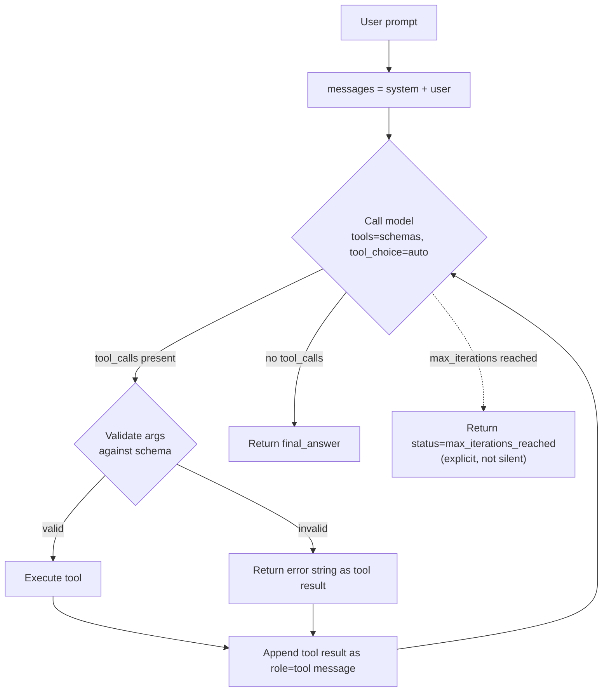

# hello-agent vs. the literature

## What this is
A minimal tool-use loop: the model is given two function schemas (`get_weather`, `calculate_expression`), the loop calls the Groq API with `tool_choice="auto"`, validates and executes whichever tool the model requests, feeds the result back as a `role: "tool"` message, and repeats until the model stops requesting tools or the iteration cap is hit.

## What it is *not*, despite the family resemblance — the one gap left standing on purpose
This pattern is commonly called "a ReAct agent" in casual usage, but it isn't ReAct as specified in Yao et al., *ReAct: Synergizing Reasoning and Acting in Language Models* (ICLR 2023, arXiv:2210.03629). ReAct's core mechanism is a **single text completion** in which the model alternates explicit `Thought: / Action: / Observation:` lines — the reasoning is a visible, loggable artifact interleaved with the action in the same generation. `hello-agent` instead uses the provider's **structured function-calling API** (the pattern OpenAI documented in 2023 and Groq mirrors): the model returns a `tool_calls` object directly, with no reasoning text attached. Whatever reasoning the model does to pick a tool happens entirely inside the model — it is never surfaced, logged, or inspectable here.

The closer literature match for what's actually implemented is the **function-calling / tool-use** line of work — e.g. Schick et al., *Toolformer: Language Models Can Teach Themselves to Use Tools* (arXiv:2302.04761) — where a model decides when and how to invoke an external function via a structured call, rather than via free-text reasoning traces.

This is the one gap left unfixed in this folder, deliberately: closing it here would blur function-calling and ReAct back together, which is exactly the conflation this folder exists to name. It's closed instead by building a separate `react-agent/` folder next, so the two mechanisms can be compared side by side on identical tasks rather than merged into one implementation that's honestly neither.

## Fixed in this revision

| Aspect | v1 (original) | Fixed here |
|---|---|---|
| Argument safety | `calculate_expression` used raw `eval()` (restricted builtins, but still arbitrary-expression evaluation) | Restricted AST walk — only whitelisted arithmetic node types are ever reachable (same approach `agent-in-streamlit/tools/math_tools.py` already used) |
| Argument validation | `json.loads(tool_call.function.arguments)` trusted as-is, no schema check | `validate_arguments()` checks parsed arguments against the declared JSON schema (required fields present, correct types) before a tool is ever invoked |
| Malformed JSON from the model | Would raise and crash the loop | Caught explicitly, returned as a tool-visible error string, loop continues |
| Iteration budget | Hard cap of 5; loop ended silently with no output if never satisfied | Explicit `"max_iterations_reached"` status with a real final-answer string — no silent failure |

## Still open, and still a real limitation
- **No retry / self-correction.** A tool error is returned as a string and appended to history; nothing tells the model to reflect on the failure before its next attempt. Reflexion (Shinn et al., 2023, arXiv:2303.11366) formalizes exactly this as an explicit verbal self-reflection step fed back before retrying — there's no equivalent here.
- **Iteration budget is still arbitrary.** ReAct tunes the step budget per task; planning-based agents bound iterations by an explicit plan length instead of a blind cutoff. `max_iterations=5` here is a safeguard, not a reasoned bound.
- **No memory across runs.** A fresh `messages` list per call, discarded after the run — by design, in contrast to `agent-in-streamlit`'s persistence layer.

## Loop, as built

